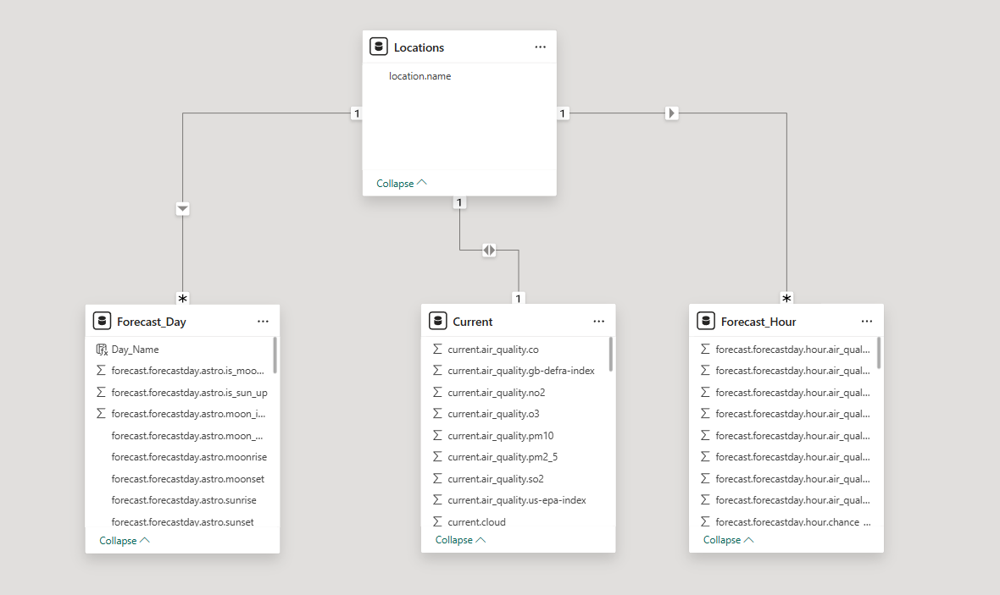

# 🌦️ Weather Analytics Dashboard – Power BI  
### Real-time Weather Insights | API-Based Data | Interactive Visualization

This project is an interactive **Power BI Weather Analytics Dashboard** built using **real-time data fetched from a Weather API**.  
It provides a consolidated and visually engaging view of the current weather, 7-day forecast, hourly forecast, air quality, sunrise & sunset times, humidity, wind speed, visibility, and more.

The dashboard is designed with a modern UI and intuitive interactions to give users a clean and comprehensive weather experience for multiple Indian cities.

---

## 🚀 Project Overview

The objective of this project is to build a **real-time weather intelligence dashboard** by integrating API data into Power BI.  
The dashboard displays:

- Live Current Weather Conditions  
- City Selection (Bangalore, Chennai, Hyderabad, Kochi, Mumbai, Vizag, etc.)  
- Hourly Forecast  
- 7-Day Weather Forecast  
- Air Quality Index (AQI)  
- Sunrise & Sunset Information  
- Humidity, Pressure, Visibility  
- Chance of Rain (daily)  
- Wind Speed  
- UV Index  
- Precipitation  

This dashboard transforms raw API responses into meaningful, user-friendly insights using Power Query and Power BI visuals.

---

## 🧩 Data Source

### ✔ API Used  
- **WeatherAPI.com** (or whichever API you used)  
- Data fetched using **Power Query Web Connector**  
- Endpoints used:
  - Current Weather
  - Hourly Forecast
  - Daily Forecast
  - Air Quality Index (AQI)
  - Astro Data (Sunrise / Sunset)

### ✔ Data Refresh  
Since API calls refresh inside Power BI Desktop, the dashboard updates with the latest data whenever refreshed.

---

## 📊 Dashboard Features

### 🔹 Current Weather Panel
- Real-time temperature  
- Weather condition (Mist, Rain, Sunny, etc.)  
- City selection buttons  
- Last updated timestamp  
- Live indicators such as humidity, visibility, wind speed, pressure, precipitation, UV index  

### 🔹 Hourly Weather Forecast
- Temperature trend for upcoming hours  
- Weather icons (cloudy, rain, clear sky, etc.)  
- Interaction-friendly line graph  

### 🔹 7-Day Weather Forecast
- Day-wise temperature  
- Daily high/low  
- Clean weekly trend visualization  

### 🔹 Air Quality Index (AQI)
- Circular AQI meter (Good, Moderate, Unhealthy, etc.)  
- CO, NO2, O3, PM10, PM2.5, SO2 levels  

### 🔹 Chance of Rain
- Daily rain probability  
- Horizontal bar visual showing % chance  

### 🔹 Sunrise & Sunset
- Astro information fetched through API  
- Clean UI for sunlight timings  

---

## 🗂️ Data Model

The data model is created by transforming JSON API responses into structured tables.

### **Tables Included**
- **Locations**  
- **Current**  
- **Forecast_Day**  
- **Forecast_Hour**

### ⭐ Relationships
- Locations → Forecast_Day (1:Many)  
- Locations → Current (1:1)  
- Locations → Forecast_Hour (1:Many)  

The model ensures seamless filtering across all weather components.

---

## 🛠️ Tools & Technologies Used

- **Power BI Desktop**  
- **Power Query Editor**  
- **Weather API Integration**  
- **JSON Data Transformation**  
- **DAX**  
- **Custom Visual Formatting & UI Design**  

---

## 📥 How to Use This Project

1. Download/clone the repository  
2. Open the `.pbix` file in **Power BI Desktop**  
3. Replace the API key (if applicable)  
4. Refresh the data to load the latest weather information  
5. Interact with the visuals to explore weather trends across cities  

---

## 📸 Dashboard Preview

### **Weather Dashboard**

### **Data Model**

---

## 💡 Key Insights

- Current real-time temperature & conditions  
- Clear understanding of rainfall probability across days  
- Air quality breakdown into detailed gas-level metrics  
- Daily & weekly temperature trends  
- Astro indicators (sunrise/sunset) for planning  
- Multi-city comparison  

---

## 🔮 Future Improvements

- Add automatic scheduled refresh using Power BI Gateway  
- Add more cities and geo-map view  
- Include historical weather dataset  
- Integrate alerts for extreme conditions  
- Add forecasted rainfall volume  

---

## 📬 Contact

**Your Name — Yasaswini Gorrepati**  
📧 yasaswinigorrepati@gmail.com  

---

# ⭐ If you like this project, don’t forget to star the repo!  
